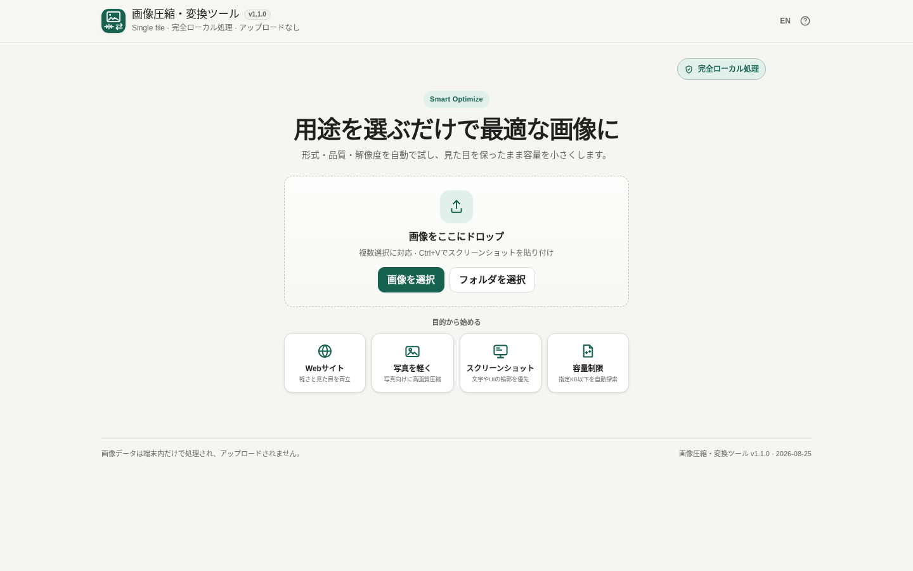

# 画像圧縮・変換ツール / Image Compressor & Converter

[](https://github.com/ttomohisa/htmlapps-image-compressor-converter/actions/workflows/deploy-pages.yml)
[](LICENSE)
[](https://ttomohisa.github.io/htmlapps-image-compressor-converter/)

[English README](README.md)

PNG / JPEG / WebPを対象に、**用途を選ぶだけで形式・品質・解像度を比較し、最適な出力を探す単一HTMLの画像最適化ワークベンチ**です。画像を外部へアップロードせず、Smart Optimizeも端末内だけで動作します。

## 🚀 デモ

### [GitHub Pagesで画像圧縮・変換ツールを開く](https://ttomohisa.github.io/htmlapps-image-compressor-converter/)

GitHub Pagesから最初のHTMLを読み込んだ後、画像の読み込み・リサイズ・圧縮・形式変換・比較・Base64生成・保存は端末内で処理されます。選択した画像がアプリからサーバーへアップロードされることはありません。

### Start画面

[](https://ttomohisa.github.io/htmlapps-image-compressor-converter/)

### Workbench

[](https://ttomohisa.github.io/htmlapps-image-compressor-converter/)

スマートフォンでは主要操作を画面下部に配置し、変換設定はsafe areaに対応したボトムシートで表示します。Webページというより、ネイティブアプリに近い操作感を意識しています。


## 主な機能

- **Start → Workbench UI**：最初は用途を選ぶシンプルな画面、画像追加後は「画像一覧 / 比較プレビュー / 最適化」の3カラムへ変化
- **Smart Optimize**：JPEG / WebP / PNGと複数の品質候補をローカルで比較し、簡易的な見た目スコアを満たす中から最小サイズを採用
- **強化した目標容量モード**：品質だけで届かない場合は解像度も段階的に下げ、指定KB以下を探索
- Webサイト / 写真 / スクリーンショット / 容量制限 / README / 透過画像 / 形式変換の目的ベースプリセット
- 変換後の方が大きい場合は元画像を自動維持（形式変換を優先したい場合は無効化可能）
- PCでは **Ctrl+V** でスクリーンショットやコピー画像を直接追加。ファイル選択はPC・スマホとも複数選択に対応
- 複数画像の元容量・出力容量・合計削減率をまとめて表示
- Before / After、差分強調、100〜400%の拡大プレビュー
- JPEG / PNG / WebP比較、保存名変更、フォルダ構造を維持したZIP保存
- **書き出し**画面にBase64 / HTML / CSS / Markdown / `<picture>` / Web素材ZIPを集約
- 日本語 / 英語を同じ単一HTML内で切り替え
- HTML読込後は **完全ローカル処理**。CSPの `connect-src 'none'` でも実行時通信を禁止

## すぐに使う

### Webで使う

[デモを開く](https://ttomohisa.github.io/htmlapps-image-compressor-converter/)だけで利用できます。インストールやアカウント登録は不要です。

### 単体HTMLをダウンロードして使う

1. リポジトリから [`dist/index.html`](https://github.com/ttomohisa/htmlapps-image-compressor-converter/blob/main/dist/index.html) をダウンロードします。
2. 最新のChromiumベースのブラウザ、Firefox、Safariなどで開きます。
3. 画像を追加すれば、そのままブラウザー内で処理できます。

### 完全オフラインで使う（上級者向け）

1. このリポジトリをダウンロードまたはクローンします。
2. Windowsで `build-standalone.bat` をダブルクリックします。
3. 生成された `dist/index.html` を任意の場所へコピーします。
4. 以降はそのHTML単体をインターネット接続なしで開けます。

より小さい自己展開形式の `dist/index.self-extract.html` も生成されます。

通常のビルドにPython、Node.js、ローカルWebサーバーは不要です。`htmlapps-template` と同じWindows PowerShellベースのビルド構成です。

## 使い方

1. PNG / JPEG / WebP画像を追加します。PCでは **Ctrl+V** でスクリーンショットやコピー画像を貼り付けられます。ファイル選択はPC・スマホとも複数選択に対応しています。
2. **Webサイト / 写真 / スクリーンショット / 容量制限**などの用途を選びます。
3. **Smart Optimize**を実行します。形式・品質候補を端末内で比較し、見た目の条件を満たす最小候補を選びます。
4. ファイルサイズ上限がある場合は **目標容量** を有効にし、KBと「見た目優先 / サイズ優先」を指定します。
5. Before / After、差分強調、合計削減率を確認します。
6. 画像を保存するか、複数画像をZIP保存します。Web制作向け出力は **書き出し** から利用できます。
7. 出力形式・正確なリサイズ・品質上限を指定したい場合だけ **詳細設定** を開きます。

### Before / After比較

通常の比較では、元画像と変換後画像を同じ位置に重ね、中央の境界線を左右に動かして表示範囲を切り替えます。

高品質なWebPやJPEGでは、ファイルサイズが大きく減っていても肉眼では差がほとんど分からないことがあります。その場合は **差分を強調** を使うと、ピクセル差を増幅して確認できます。

### Web制作向け出力

画像変換だけでなく、Web制作ですぐ使える以下の形式も生成できます。

- Base64 Data URI
- `` 用HTML
- CSS `background-image`
- Markdown画像記法
- フォールバック付き `<picture>`
- Web素材一式のZIP

## GitHub Pagesで公開する

このリポジトリには、単体HTMLをビルド・検証して `dist/` をGitHub Pagesへ自動公開するワークフローが含まれています。

1. リポジトリ名を `htmlapps-image-compressor-converter` としてGitHubへプッシュします。
2. **Settings → Pages → Build and deployment → Source** で **GitHub Actions** を選択します。
3. `main` ブランチへプッシュするか、Actions画面からPages公開ワークフローを手動実行します。
4. ビルド成功後、`https://ttomohisa.github.io/htmlapps-image-compressor-converter/` で公開されます。

GitHub Pagesがまだ有効化されていない場合は、ビルド自体を成功させたままデプロイだけをスキップし、ActionsのSummaryに設定方法を表示する構成です。

## 開発とビルド

```text
.
├─ src/index.template.html       # アプリ本体のソーステンプレート
├─ app.config.json               # アプリ名・バージョン・ビルド設定
├─ dependencies.json             # 内包依存の定義
├─ build-standalone.bat          # Windows用ビルド入口
├─ build-standalone.ps1          # 単体HTML生成処理
├─ scripts/
│  ├─ check-repository.ps1       # リポジトリ・ビルド検証
│  ├─ verify-standalone.ps1      # 単体HTML・通信制約の検証
│  └─ build-self-extract.ps1     # 自己展開版HTML生成
├─ dist/
│  ├─ index.html                 # メインの配布物
│  └─ index.self-extract.html    # 自己展開版
└─ .github/workflows/
   ├─ build-standalone.yml        # ビルド検証
   └─ deploy-pages.yml            # GitHub Pages公開
```

ローカルビルド：

```bat
build-standalone.bat
```

ビルド時には単体HTMLを生成し、未置換プレースホルダーや禁止された実行時ネットワーク参照が残っていないことを検査します。

## プライバシーと通信防止

このアプリはローカル処理を前提にしています。

- 選択した画像は作業中のブラウザーメモリ内で処理されます。
- 選択した画像をアプリから外部サーバーへアップロードしません。
- Content Security Policyで `connect-src 'none'` を指定しています。
- アナリティクス、テレメトリ、ログイン、クラウド保存はありません。
- 画像データ自体はLocalStorageへ保存せず、言語と変換設定だけを保持します。
- ファイル保存はユーザー操作後にのみ実行します。

GitHub Pages版では最初のHTMLを取得する通信だけ発生します。ページ読み込み後の画像処理は端末内で行われます。完全にネットワークを切って使用する場合は、生成済みの `dist/index.html` を直接開いてください。

## 制限事項

- PNG出力はロスレスです。目標容量モードではPNGは解像度を下げて容量を調整し、JPEG / WebPは品質と解像度の両方を探索します。
- WebPのエンコード可否や結果はブラウザーのCanvas実装に依存します。
- ブラウザーごとに画像エンコーダーが異なるため、同じ設定でも最終ファイルサイズが多少変わる場合があります。
- 非常に大きい画像や大量の一括処理では、端末メモリを多く使用します。
- Canvasで再エンコードするため、EXIF等のメタデータは意図的に除去されます。
- 現在の処理ではアニメーション画像のアニメーションは維持されません。

## 使用ライブラリ

画像処理の実行時にはCanvas、Blob、FileReaderなどのブラウザー標準APIを利用しており、現時点では画像処理用のサードパーティライブラリを必要としません。

依存関係やライセンスについては [THIRD_PARTY_NOTICES.md](THIRD_PARTY_NOTICES.md) を確認してください。

## コントリビューション

バグ報告や機能提案はGitHub Issuesからお願いします。開発への参加方法は [CONTRIBUTING.md](CONTRIBUTING.md) を確認してください。

## ライセンス

Copyright © 2026 ttomohisa

このプロジェクトは [MIT License](LICENSE) で公開されています。
