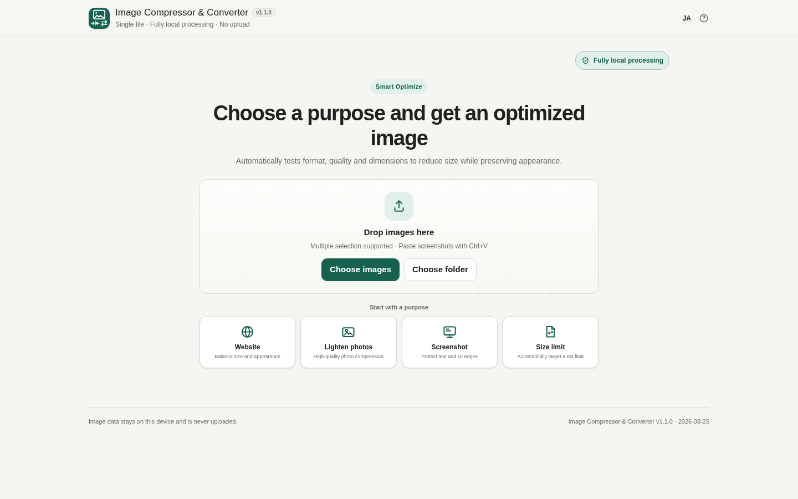
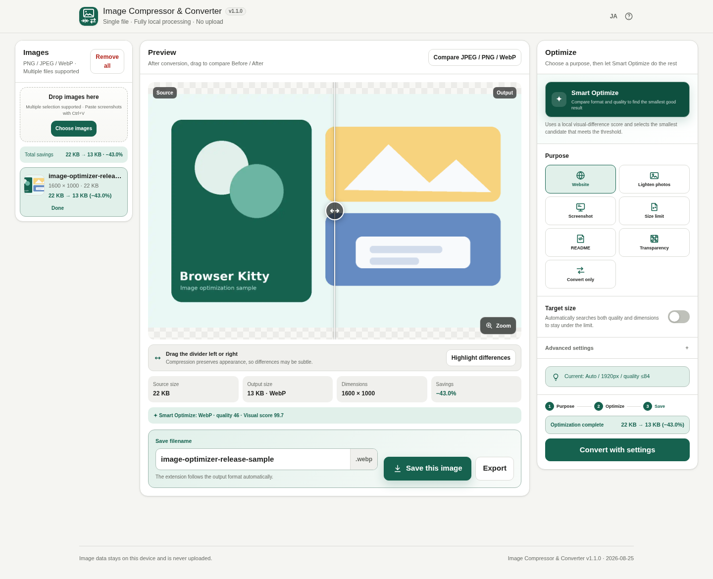
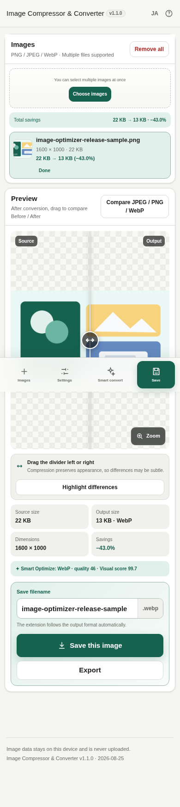

# Image Compressor & Converter

[](https://github.com/ttomohisa/htmlapps-image-compressor-converter/actions/workflows/deploy-pages.yml)
[](LICENSE)
[](https://ttomohisa.github.io/htmlapps-image-compressor-converter/)

[日本語版 README](README.ja.md)

A privacy-focused, single-HTML image optimization workbench for PNG, JPEG and WebP. Smart Optimize compares formats and quality locally, while target-size mode can reduce both quality and dimensions to hit practical upload limits.

## 🚀 Live demo

### [Open Image Compressor & Converter on GitHub Pages](https://ttomohisa.github.io/htmlapps-image-compressor-converter/)

GitHub Pages delivers the initial HTML. After it loads, image decoding, resizing, compression, format conversion, comparison, Base64 generation and export are processed locally on your device. Images you select are not uploaded by the app.

### Start screen

[](https://ttomohisa.github.io/htmlapps-image-compressor-converter/)

### Workbench

[](https://ttomohisa.github.io/htmlapps-image-compressor-converter/)

The mobile layout is designed to feel closer to a native app, with primary actions fixed near the bottom of the screen and conversion settings shown as a safe-area-aware bottom sheet.



## Features

- **Start → Workbench UI**: a simple purpose-first start screen becomes a three-column image / preview / optimization workbench
- **Smart Optimize**: locally compares JPEG / WebP / PNG candidates and uses a lightweight visual-difference score to choose the smallest acceptable output
- **Adaptive target size**: searches quality first and progressively reduces dimensions when needed to reach the requested KB limit
- Purpose presets for websites, photos, screenshots, upload limits, README assets, transparent images and format-only conversion
- Automatically keeps the source file when conversion would make it larger (can be disabled for intentional format conversion)
- On desktop, paste screenshots and copied images directly with **Ctrl+V**; file picking supports multiple images on desktop and mobile
- Batch summary showing total source size, output size and savings
- Before / After slider, amplified difference view and 100–400% large preview
- JPEG / PNG / WebP comparison, editable filenames and folder-aware ZIP export
- Dedicated **Export** dialog for Base64, HTML, CSS, Markdown, `<picture>` and Web-assets ZIP
- Japanese / English UI in the same standalone HTML
- **Fully local processing** after the HTML is loaded; runtime network access is blocked with `connect-src 'none'`

## Quick start

### Use the web demo

Just [open the demo](https://ttomohisa.github.io/htmlapps-image-compressor-converter/). No installation or account is required.

### Use the standalone HTML

1. Download [`dist/index.html`](https://github.com/ttomohisa/htmlapps-image-compressor-converter/blob/main/dist/index.html) from this repository.
2. Open it in a current Chromium-based browser, Firefox, or Safari.
3. Add one or more images and process them entirely in the browser.

### Use it fully offline (advanced)

1. Download or clone this repository.
2. Double-click `build-standalone.bat` on Windows.
3. Copy the generated `dist/index.html` wherever you need it.
4. Open that single file later without an internet connection.

The repository also generates `dist/index.self-extract.html`, a smaller self-extracting HTML variant.

Python, Node.js and a local web server are not required for the normal build. The builder uses Windows PowerShell and the built-in `tar.exe` infrastructure from `htmlapps-template`.

## Usage

1. Add one or more PNG, JPEG or WebP images. On desktop, you can also paste screenshots or copied images with **Ctrl+V**. The file picker supports multiple selection on desktop and mobile.
2. Choose a purpose such as **Website**, **Photo**, **Screenshot** or **Size limit**.
3. Run **Smart Optimize**. The app compares candidate formats / quality levels locally and picks the smallest result that meets its visual threshold.
4. For upload constraints, enable **Target size** and enter the maximum KB. Choose **Appearance first** or **Size first**.
5. Review Before / After, the difference view and batch savings.
6. Save the current image, save the batch as ZIP, or open **Export** for web/developer output.
7. Use **Advanced settings** when you need an exact format, resize rule or quality ceiling.

### Before / After comparison

The normal comparison places the original and converted image at the same coordinates and reveals them with a draggable divider. With high-quality compression, visible differences can be extremely small even when the file-size reduction is substantial.

Use **Highlight differences** to generate an amplified pixel-difference view when you want to verify where the converted image differs from the source.

### Developer exports

For web-development workflows, the app can generate:

- Base64 data URI
- `` HTML
- CSS `background-image`
- Markdown image syntax
- `<picture>` markup with a fallback image
- A ready-to-download web-assets ZIP

## Publish with GitHub Pages

The repository includes a workflow that builds the standalone HTML, verifies its offline/runtime-network constraints and deploys `dist/` to GitHub Pages.

1. Push the repository to GitHub as `htmlapps-image-compressor-converter`.
2. Open **Settings → Pages → Build and deployment → Source** and select **GitHub Actions**.
3. Push to `main`, or manually run the Pages deployment workflow from the Actions tab.
4. After a successful deployment, the demo is available at `https://ttomohisa.github.io/htmlapps-image-compressor-converter/`.

If GitHub Pages has not been enabled yet, the workflow keeps the successful build result and skips deployment with setup guidance instead of failing at `configure-pages`.

## Development and build layout

```text
.
├─ src/index.template.html       # Application source template
├─ app.config.json               # App name, version and build settings
├─ dependencies.json             # Embedded dependency definition
├─ build-standalone.bat          # Windows build entry point
├─ build-standalone.ps1          # Standalone HTML builder
├─ scripts/
│  ├─ check-repository.ps1       # Repository/build verification
│  ├─ verify-standalone.ps1      # Standalone/runtime-network checks
│  └─ build-self-extract.ps1     # Self-extracting HTML builder
├─ dist/
│  ├─ index.html                 # Main release artifact
│  └─ index.self-extract.html    # Self-extracting variant
└─ .github/workflows/
   ├─ build-standalone.yml        # Build validation
   └─ deploy-pages.yml            # GitHub Pages deployment
```

Build locally with:

```bat
build-standalone.bat
```

The build process generates the standalone HTML and verifies that no unresolved build placeholders or prohibited runtime-network references remain.

## Privacy and runtime network protection

The generated HTML is designed for local-first processing:

- Image bytes remain in browser memory while you work.
- Selected images are not uploaded by the app.
- The runtime Content Security Policy includes `connect-src 'none'`.
- The app has no analytics, telemetry, login or cloud storage.
- Image data is not written to LocalStorage; only language and conversion settings are persisted.
- Downloads occur only after a user action.

The GitHub Pages version requires the initial HTML request. After loading, image processing runs locally. To use the app with the network completely disconnected, open the generated `dist/index.html` directly.

## Limitations

- PNG output is lossless. In target-size mode, PNG can only become smaller by reducing dimensions; JPEG / WebP can adjust both quality and dimensions.
- WebP encoding support depends on the browser's Canvas implementation.
- Exact compressed size can differ between browsers because encoding is browser-provided.
- Very large images or large batches can consume substantial device memory.
- Metadata is intentionally removed when an image is re-encoded through Canvas.
- Animated images are not preserved as animation by the current image-processing flow.

## Dependencies

The current image-processing runtime uses browser APIs such as Canvas, Blob and FileReader and does not require a third-party image-processing library at runtime.

See [THIRD_PARTY_NOTICES.md](THIRD_PARTY_NOTICES.md) for dependency and licensing notes.

## Contributing

Bug reports and feature proposals are welcome through GitHub Issues. See [CONTRIBUTING.md](CONTRIBUTING.md) for development guidance.

## License

Copyright © 2026 ttomohisa

Licensed under the [MIT License](LICENSE).
