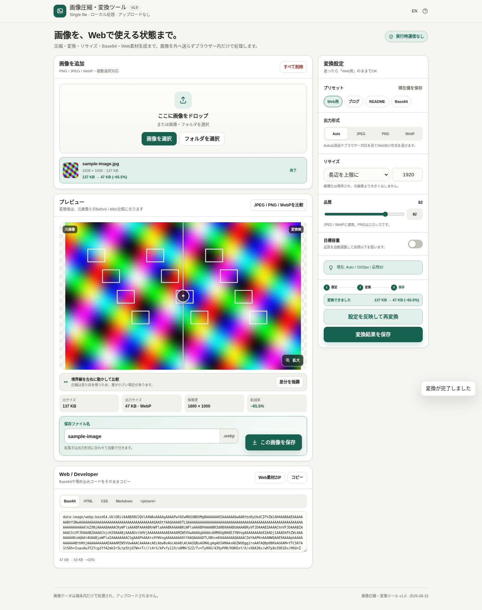
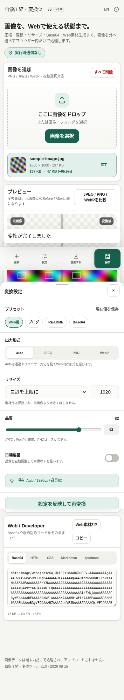

# Image Compressor & Converter

A privacy-friendly **single HTML image toolkit** for compressing, converting, resizing and preparing images for the web entirely in the browser.

[日本語 README](README.ja.md)



On smartphones, primary actions stay in a bottom action bar and conversion settings open as a bottom sheet.



## Features
- PNG / JPEG / WebP input and output
- Auto format selection, resize and quality controls
- Target-size quality search for JPEG/WebP
- Batch conversion and folder-aware ZIP export
- Source/output Before / After slider with a visible draggable divider
- Amplified pixel-difference view for subtle compression changes
- JPEG / PNG / WebP format-size comparison
- Base64, HTML, CSS, Markdown and `<picture>` snippets
- Web-assets ZIP with WebP + JPEG/PNG fallback
- Metadata stripping through Canvas re-encoding
- Japanese / English UI
- Native-app-like mobile bottom actions and settings sheet
- Desktop Settings → Convert → Save workflow with a prominent post-conversion Save CTA
- No runtime network access

## Build
```powershell
.\build-standalone.bat
```
Outputs: `dist/index.html`, `dist/index.self-extract.html` and manifests.

## Privacy
The runtime CSP contains `connect-src 'none'`. Image bytes are not stored in LocalStorage; only language and conversion settings are persisted.

## License
MIT

## Recent UX improvements
- Clear Before / After divider plus an amplified difference view for changes that are hard to see
- Large preview with 100–400% zoom and pan/pinch gestures
- Editable output filenames
- Desktop Settings → Convert → Save workflow with Save promoted after conversion
- Save becomes the primary mobile action after conversion
